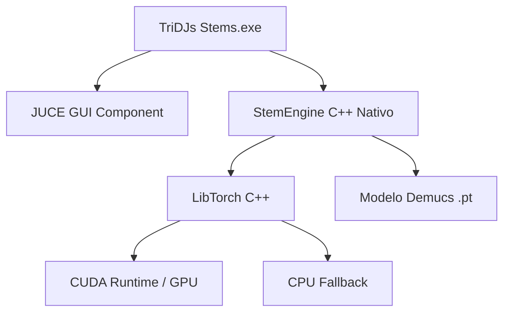

# 🌌 TriDJs Stems Suite

[](https://en.cppreference.com/w/cpp/17)
[](https://juce.com/)
[](https://pytorch.org/)
[](https://microsoft.com/windows)
[](#-licença-e-créditos--license-and-credits)

O **TriDJs Stems Suite** é um software desktop de nível profissional e alta performance projetado para DJs e produtores musicais realizarem a separação de faixas de áudio (*stems*) de forma 100% local e acelerada por hardware (IA nativa). 

Toda a inteligência artificial (modelo Demucs) executa de forma integrada diretamente no mesmo processo da aplicação principal via C++ (**LibTorch / CUDA**), eliminando latências de linha de comando, daemons externos e conflitos com antivírus.

---

## 💎 Licença e Créditos / License and Credits

> [!IMPORTANT]
> ### 🇧🇷 Termos de Uso (Português)
> Este é um **software livre e gratuito para uso comercial e pessoal**, sob a única e obrigatória condição de que sejam dados os devidos créditos de autoria e propriedade intelectual aos criadores da marca registrada **@tridjs**. 
>
> **@tridjs** é uma marca registrada. É expressamente proibida a redistribuição ou reutilização comercial deste software sem a menção explícita de crédito aos desenvolvedores originais.

> [!IMPORTANT]
> ### 🇺🇸 Terms of Use (English)
> This is a **free software for personal and commercial use**, under the sole and mandatory condition that appropriate credit is given to the creators of the registered trademark **@tridjs**.
>
> **@tridjs** is a registered trademark. Any redistribution, commercial rebranding, or use of this software must clearly credit the original developers.

---

## ✨ Recursos Principais (Key Features)

*   **⚡ Arquitetura 100% Nativa (C++)**: IA executada internamente no mesmo processo da GUI através da LibTorch (C++ bindings do PyTorch), eliminando o spawn de processos CLI, redirecionamentos de `stdout` por pipes e travamentos heurísticos de antivírus.
*   **🎮 Splash Screen Cinematográfica & Premium**: Tela de inicialização futurista e minimalista (500x500 borderless, fundo preto absoluto `#050505`) com efeitos de *fade-in/fade-out* suaves e monitoramento de *warm-up* de hardware (CUDA, VRAM e modelo neural) em tempo real.
*   **🧠 Separação de Alta Fidelidade (Demucs)**: Divisão de qualquer arquivo de áudio (`.wav`, `.mp3`, `.flac`) em 4 canais de qualidade profissional:
    *   🎤 **Vocais** (Vocals)
    *   🥁 **Bateria** (Drums)
    *   🎸 **Baixo** (Bass)
    *   🎹 **Outros / Instrumental** (Instruments)
*   **🎨 UI Futurista Dark Mode**: Interface responsiva e animada construída no framework **JUCE**, inspirada em elementos de design premium, equipada com reprodutores de stems integrados, formas de onda dinâmicas e exportação simplificada (estems individuais ou pacote zip completo).
*   **🚀 Aceleração por Hardware (CUDA/GPU)**: Detecção automática e priorização de GPUs NVIDIA compatíveis com CUDA para separação em ultra-velocidade (segundos), com fallback dinâmico e seguro para CPU.

---

## 🛠️ Arquitetura do Sistema (System Architecture)



---

## 💻 Requisitos de Sistema

*   **SO**: Windows 10 ou Windows 11 (64-bit).
*   **GPU (Opcional, mas Recomendada)**: Placa de vídeo NVIDIA compatível com CUDA para aceleração de IA.
*   **Dependências Locais**: LibTorch (C++ PyTorch) instalada no caminho do sistema.

---

## 🔧 Como Compilar o Projeto

Este projeto utiliza o **CMake** integrado ao JUCE 7 para gerenciamento de build:

1. **Configurar o caminho da LibTorch**:
   Certifique-se de que a LibTorch está extraída e aponte a variável no `CMakeLists.txt`:
   ```cmake
   set(CMAKE_PREFIX_PATH "C:/TridjsStems/libtorch")
   ```

2. **Gerar a estrutura com CMake**:
   ```bash
   cmake -B build -S .
   ```

3. **Compilar em Modo Release (Otimizado)**:
   ```bash
   cmake --build build --config Release --parallel
   ```

---

## 📣 Contatos & Redes
Siga e acompanhe o trabalho dos criadores:
*   **Instagram/TikTok/GitHub**: **@tridjs** 🏷️ *(Marca Registrada)*
